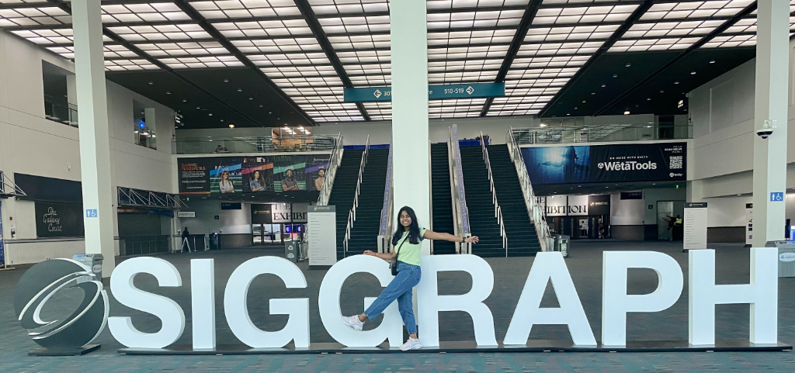

# SIGGRAPH Pixel Planner



SIGGRAPH Pixel Planner is an unofficial attendee planner for SIGGRAPH 2026 in Los Angeles.

I built it because SIGGRAPH is the kind of conference where the day can get wonderfully chaotic very quickly: talks, labs, art, demos, hallway conversations, offsite mixers, and the constant question of "can I actually make it from this room to that room in time?"

This project turns that chaos into a small pixel-world planner. You can build a day, preview where things are inside the Los Angeles Convention Center, add side events, track what you actually attended, and generate a tiny recap GIF at the end.

## Why This Exists

SIGGRAPH is special to me.

I first volunteered at the 50th SIGGRAPH conference as a Student Volunteer, and coming back to Los Angeles after three years, now as a Team Leader, feels like a full-circle moment. This app is part practical tool, part love letter to the conference, and part experiment in making dense conference planning feel playful instead of stressful.

SIGGRAPH brings together computer graphics, animation, VFX, interactive technology, research, art, games, XR, production, and creative engineering. That range is exciting, but it also means the schedule can be hard to reason about at a glance. Pixel Planner is my attempt to make the week easier to explore.

## What It Can Do

- Search the SIGGRAPH 2026 public program.
- Filter by day, program type, location, registration type, and live-at-selected-time.
- Choose a registration type: Full Conference, Experience, or Discover.
- Build a personal schedule across the full conference.
- Add official sessions and side events to the same plan.
- Open side-event names directly as RSVP/source links.
- Preview LACC rooms with a 3D venue map.
- Estimate walking time and flag tight transitions.
- Collapse overlap, floor-change, and walking warnings into useful plan notes.
- Export a calendar file.
- Copy a readable plan summary.
- Mark sessions and events as attended.
- Generate a recap GIF with your Pixel avatar.
- Customize the Pixel avatar look if you want to.

## Side Events

The planner includes a small side-event list from local CSV sources. These are shown under the `Side events` tab and can be added to `My Pixel Plan` like any other timed item.

Rows without a usable date/time are skipped, because the app needs real time ranges for conflict checks, calendar export, and recap logic.

## Privacy-Friendly Visit Counts

The app supports GoatCounter for lightweight visit counting.

It is disabled unless a GoatCounter code is provided at build time:

```bash
VITE_GOATCOUNTER_CODE=jayasri npm run build
```

That injects:

```html
<script data-goatcounter="https://jayasri.goatcounter.com/count" async src="https://gc.zgo.at/count.js"></script>
```

This gives approximate page views and visitor counts in GoatCounter. It is not an exact count of humans, because browsers, blockers, and multiple devices affect analytics.

## Tech Stack

- React
- TypeScript
- Vite
- Three.js for the 3D venue view and recap rendering
- Canvas + gifenc for recap GIF generation
- Local storage for personal planner state
- GitHub Pages for hosting
- GoatCounter for optional privacy-friendly analytics

## Data

Core schedule data lives in:

- `src/data/officialSchedule.json`
- `src/data/schedule.ts`
- `src/data/sideEvents.ts`

Every timed item uses this shape:

```ts
id, title, program, day, date, start, end, room, floor, tags, sourceUrl
```

The official SIGGRAPH schedule is linked here:

<https://s2026.conference-schedule.org/>

This is an unofficial planner. Registration filters and eligibility logic are best-effort and should be confirmed against SIGGRAPH's official rules before relying on them.

## Venue Maps

The venue geometry is modeled from public Los Angeles Convention Center floor-plan PDFs:

- Level 1 Exhibit Halls: <https://www.laconventioncenter.com/assets/doc/LevelOne-ExhibitHalls-41aa5293da.pdf>
- Level 2 Meeting Rooms: <https://www.laconventioncenter.com/assets/doc/LevelTwo-MeetingRooms-d8a1e35187.pdf>

The map is optimized for attendee planning, not for CAD-level precision. Walking estimates use relative room centers plus floor-change penalties.

## Local Development

```bash
npm install
npm run dev
```

Verify before publishing:

```bash
npm run test
npm run build
```

Build with analytics enabled:

```bash
VITE_GOATCOUNTER_CODE=jayasri npm run build
```

## GitHub Pages

This Vite project uses `base: "./"` so the built app can be served from a project subpath.

Build the project, then publish the generated `dist/` folder to the `gh-pages` branch.

